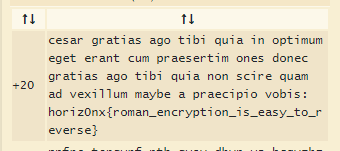

# WriteUp Antiquity

Le code à déchiffrer: https://ctf.0xhorizon.eu/files/antiquity.txt

L'indice étant: **Do you know roman antiquity ?**

Cela nous évoque directement **le code de césar**.

Grâce à ce site: https://www.dcode.fr/chiffre-cesar. On va pouvoir déchiffrer le code.
On ajoute notre message chiffré et on selectionne Tester tous les décalages.

On se retrouve avec ce résultat:

Bingo!On a le flag lorsque l'on fait un décalage de 20(c'est à dire un u chiffré devient un a)
