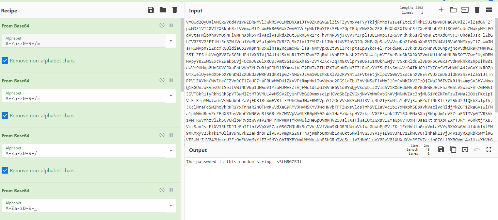

# WriteUp baseDecoding
commande: `nc 0xhorizon.eu 9999`

## Comprendre le challenge

`nc 0xhorizon.eu 9999`:

```bash
Take care of this secret information please ('Vm0wd2QyUXlVWGxWV0d4V1YwZDRWMVl3WkRSV01WbDNXa1JTV0ZKdGVGWlZiVFZyVmxVeFYyTkljRmhoTWsweFZtcEdTMk15U2tWVWJHaG9UVlZ3VlZadGNFZFpWMDE1VTJ0V1ZXSkhhRzlVVmxaM1ZsWmFkR05GWkZwV01VcEpWbTEwYTFkSFNrZGpTRUpYWVRGd2FGcFdXbXRXTVhCRlZXeFNUbUY2UlRCV01uUnZWakpHYzFOdVVtaFNlbXhXVm0xNFlVMHhXbk5YYlVaclVsUkdXbGt3WkRSVk1rcFhVMnR3VjJKVVJYZFpla3BIWXpGT2RWVnRhRk5sYlhoWFZtMXdUMVF3TUhoalJscFlZbGhTV0ZSV2FFTlNiRnBZWlVoa1YwMUVSa1pWYkZKRFZqSkZlVlJZYUZkU1JWcHlWVEJhVDJOc2NFaGpSazVwVmpKb2IxWXhXbE5TTVd4V1RVaG9WMkpyTlZsWmJHaFRWMVpXY1ZKcmRGUldia0pIVmpKNFQxWlhTa2RqUmxwWFlsaFNNMVpxU2t0V1ZrcFpXa1p3YkdFelFrbFdWM0JIVkRKU1YxWnVUbGhpVjNoVVdWUk9RMWRHV25STlZFSlhUVmQ0V0ZaSGRHdFdiVXBIVjJ4U1dtSkhhRlJXTUZwVFZqRmtkVnBIZUdsU2JYY3hWa1phVTFVeFduSk5XRXBZVmtWd1dGbHNhRk5OTVZweFUydDBWMVpyY0ZwWGExcHZWakpLVjFOcmJGZGlXRUpJVmtSS1UxWXhaSFZVYkZKcFZqTm9XVlpYY0U5aU1XUkhWMjVTVGxKRlduSlVWbFp6VGxaYVdHVkhkR2hpUlhBd1dWVm9UMVp0Um5KVGJXaFhUVVp3YUZwRlpFOU9iRXAwWlVaT2FWTkZTbUZXTW5oWFdWZEZlRmRzYUZSaE1sSnhWVzB4TkdGR1ZYZGhSVTVUVW14d2VGVXlkR0ZpUmxwelUyeHdXbFpXY0hKWlZXUkdaVWRPU1dKR1pGZFNWWEJ2Vm10U1MxUXlVa2RVYmtwaFVteEtjRlpxVG05V1ZscEhXVE5vYVUxcmJEUldNV2h2V1ZaS1JsTnRPVlZXYkhCWVZHeGFZVmRGTlZaUFZtaFRUVWhDU1ZkVVFtRmpNV1IwVWxoc2FGSldTbUZhVjNSaFlVWnJlRmRyWkZkV2EzQjZWa2R6TVZkR1NsWmpSV3hYWWxoQ1RGUnJaRVpsUm1SellVWlNhVkp1UW5oV1YzaHJWVEZzVjFWc1dsaGlWVnB6V1d0YWQyVkdWblJOVldSV1RXdHdWMVp0Y0dGWGJGcFhZMGhLV2xaWFVrZGFWV1JQVTBkR1IyRkhiRk5pYTBwMlZtMTBVMU14VW5SV2EyUnFVbGQ0Vmxsc1pHOVdSbEpZVGxjNVYxWnRVbGhXVjNNMVZXc3hjMU51Y0ZkTmFsWlVWa2Q0UzFKc1pIVlRiRlpYWWtadmVsWkdWbUZaVjFKR1RsWmFVRll5YUhCVmJHaERWMVphY1ZOcVVsWk5WMUl3Vld4b2IyRnNTa1pPVjBaaFZqTlNhRll3V25kU2JIQkhXa1pTVjJKclNraFdSM2hoVkRKR1YxTnNaR2hOTWxKWVdXeG9RMVJHVW5KYVJWcHNVbTFTZWxsVldsTmhSVEZaVVc1b1YxWXphSEpXVkVaclVqRldjMkZGT1ZkaGVsWlFWa1phWVdReVZrZFdXR3hyVWpCYWNGVnRlSGRsYkZWNVpVaGtXR0pHY0ZoWk1HaExWakpHY2xkcmVGZE5WbkJJV1RJeFMxSXhjRWhpUm1oVFZsaENTMVp0TVRSVk1VMTRWVmhzVlZkSGVGWlpWRVozWVVaV2NWTnRPVmRTYkVwWlZHeGpOVmRHV25OalJXaFlWa1UxZGxsV1ZYaGpNVTUxWTBaa1RtRnNXbFZXYTJRMFV6RktjMXBJVmxSaVJscFlXV3RhZDJJeFpITlhiVVpXVFZac05GZHJhRk5oTVVsNVlVWm9XbGRJUWxoVk1WcGhWbFpPVlZKc1ZrNVdia0kxVmtaYVYyRXhXWGhhUldob1VtMW9XRmxyV25kTk1YQllaVWhLYkZZeFdrbFZiVEV3VmpKS2NsTnJjRmhpUmxwb1dWUktSMVl4VG5OYVIyaE9UV3hLV1ZkWGVGTlNhekZIVjJ4V1UyRXpRbk5WYlRGVFRWWlZlV042UmxoU2EzQmFWVmMxYjFZeFdYcGhTRXBYVmtWYWVsWnFSbGRqTVdSellVZHNhVlpyY0RaV01XUXdXVmRSZVZaclpGZGliRXBQVm14a1UxWXhVbGhrU0dSWFRWZDRlVlpYTVVkWFJrbDNWbXBTV2sxR1NsQldNbmhoVjBaV2NscEhSbGRXTVVwUlZsUkdhMU14U1hoalJXUmhVbXMxV0ZZd1ZrdE5iRnAwVFZSQ1ZrMVZNVFJXVm1oelZsWmtTR0ZJUmxaaVIxRXdWbXBHYzJNeVJrWlViR1JUWWxob1lWZFVRbUZoTVdSSVUydGthbEp0ZUdGVVZWcGFaREZzVjFaWWFHcGlWWEJHVmxkNGExUnNXWGxoUkVwWFlXdEtjbFY2Umt0amF6VlhXa1pXYVZKc2NGbFhWM1J2VVcxV2MxcElUbGhpVlZwWFZGZHplRTVHWkhKaFJrNW9UVlZ3TUZaWGN6VlhiRnBHVjIxR1ZWWnNjR2haZWtaM1VsWldjMWRyTlZkaVdHTjRWbXhrTkdJeVRYaFhiazVZWVRGd1ZWbHJaRzlYUm14WVkzcEdhMkpIZUZkV01qRkhZV3hhY21OSWNGaGhNWEIyVm1wS1MyTnNUbkppUm1SWFlsWkZkMVl4V21GWGJWWkhWRzVLV0dKRk5WaFZiRnBXVGxFOVBRPT0=') : 
```

On utilise [cyberchef](https://gchq.github.io/CyberChef/) pour trouver comment dechiffrer le message.



On peut donc voir que le message est une succession de base64 pour à la fin avoir un message du type **The password is this random string: XXXXXX**.

## Coder la solution

Pour recupérer le message à déchiffrer toujours une bonne vieille regex.
`.* \('(?P<base>.*)'\).*`:

- `.* \('`: pour eliminer tout le début du message
- `(?P<base>.*)`: pour récuperer l'intégralité du message codé
- `'\).*`: le reste
  
Une fois le message obtenu on fait une boucle sale pour faire un base64 decode tant que c'est possible.

Code:

```python
import base64
import re

from pwnlib.tubes.remote import remote
conn = remote('0xhorizon.eu',9999)
message = conn.recvuntil(': ', drop=True).decode()
regex = r".* \('(?P<base>.*)'\).*"
m = re.match(regex, message)
if m:
    text = m.group("base")
    while True:
        try:
            text = base64.b64decode(text)
        except:
            break
    print(text)
```

Maintenant on a un message du type **The password is this random string: XXXXXX**.Encore une regex pour extraire le mot de passe et le tour est joué.

## Code final

```python
import base64
import re

from pwnlib.tubes.remote import remote
conn = remote('0xhorizon.eu',9999)
message = conn.recvuntil(': ', drop=True).decode()
regex = r".* \('(?P<base>.*)'\).*"
m = re.match(regex, message)
if m:
    text = m.group("base")
    while True:
        try:
            text = base64.b64decode(text)
        except:
            break
    regex = r".*: (?P<password>.*)"
    password = re.match(regex, text.decode()).group("password")
    print(message)
    print(password)
    conn.send(password.encode() + b'\r\n')
    print(conn.recvline())
```