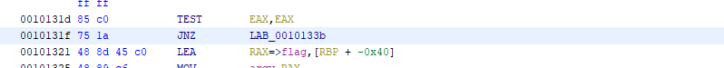
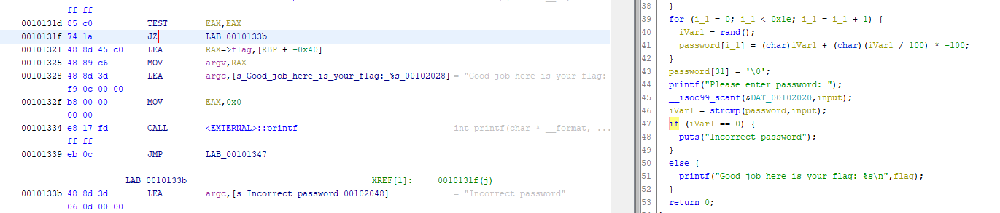
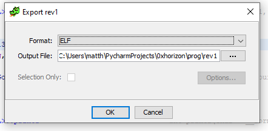

# WriteUp randomPassword

Lien des resources: https://ctf.0xhorizon.eu/files/rev.zip

On a un binaire `file rev`:
```
rev: ELF 64-bit LSB pie executable, x86-64, version 1 (SYSV), dynamically linked, interpreter /lib64/ld-linux-x86-64.so.2, BuildID[sha1]=035bc5dec7cfc7d57ea4ae9070319130afae6b36, for GNU/Linux 3.2.0, with debug_info, not stripped
```

on le lance `./rev`:
```
Please enter password: azeaze
Incorrect password
```

## Désassemble le Binaire

On lance [ghidra](https://ghidra-sre.org/InstallationGuide.html):

On obtient le code suivant après l'avoir analysé:

```c

/* WARNING: Could not reconcile some variable overlaps */

int main(int argc,char **argv)

{
  int iVar1;
  time_t tVar2;
  size_t sVar3;
  char input [100];
  char password [32];
  char key [25];
  char encrypted [25];
  char flag [25];
  int i_1;
  int i;
  
  tVar2 = time((time_t *)0x0);
  srand((uint)tVar2);
  flag._0_8_ = 0;
  flag._8_8_ = 0;
  flag._16_8_ = 0;
  flag[24] = '\0';
  encrypted._0_8_ = 0x59271b4b275d3905;
  encrypted._8_8_ = 0x2755531f44687c13;
  encrypted._16_8_ = 0x2b776321653a571a;
  encrypted[24] = '\x0f';
  key._0_8_ = 0x21492b314e2f566d;
  key._8_8_ = 0x4271217a322d2e68;
  key._16_8_ = 0x674753423a496645;
  key[24] = 'r';
  i = 0;
  while( true ) {
    sVar3 = strlen(key);
    if (sVar3 <= (ulong)(long)i) break;
    flag[i] = key[i] ^ encrypted[i];
    i = i + 1;
  }
  for (i_1 = 0; i_1 < 0x1e; i_1 = i_1 + 1) {
    iVar1 = rand();
    password[i_1] = (char)iVar1 + (char)(iVar1 / 100) * -100;
  }
  password[31] = '\0';
  printf("Please enter password: ");
  __isoc99_scanf(&DAT_00102020,input);
  iVar1 = strcmp(password,input);
  if (iVar1 == 0) {
    printf("Good job here is your flag: %s\n",flag);
  }
  else {
    puts("Incorrect password");

  }
  return 0;
}
```

On voit que on construit le flag une string et on la compare a ce que l'on a écrit sur l'entrée standard et si ils sont égaux on affiche le flag sinon on afficher Incorrect password.

## Exploitation
On va donc changer la comparaison pour que se soit si le flag et différent du password entrée, on affiche le flag.

Pour cela on se mets à l'adresse où à lieu la comparaison(on mets notre curseur de souris sur *le if (iVar1 == 0) {*)



Sur la ligne du JNZ on fait clic droit -> patch instruction et on change le JNZ par JZ



On voit que la condition c'est inversé.
Une fois cela fait on fait file -> export -> on selectionne format elf



On lance le nouveau programe:

```
./rev1 
Please enter password: zadfzedf
Good job here is your flag: horiz0nx{FLAG}
```
